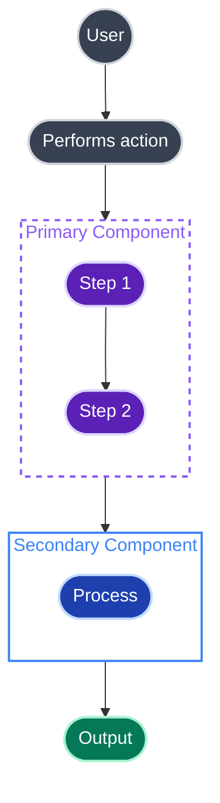
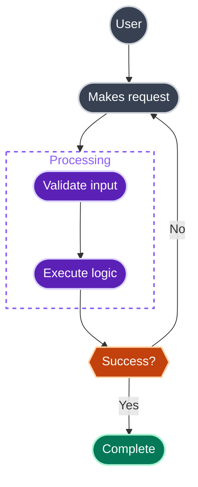
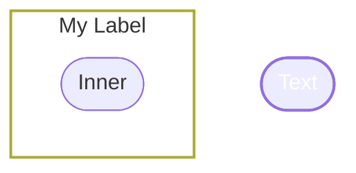

# Mermaid Diagram Skill

This skill provides guidance on creating beautiful, professional Mermaid diagrams that render correctly on GitHub and work well in both light and dark mode.

## Core Principles

1. **Use dark fills with light strokes** — Ensures readability in both light and dark mode
2. **Set subgraph fills to `none`** — Allows subgraphs to adapt to any background
3. **Use rounded shapes** — `([text])` for stadium shapes, `((text))` for circles
4. **No Font Awesome icons** — GitHub doesn't support `fa:fa-*` icons, they render as text
5. **Quote subgraph labels** — Use `subgraph Name["Label Text"]` syntax
6. **Define classDef styles at the top** — Keep all styling together for maintainability
7. **Render and self-check**: auto-layout makes its own routing choices, so always preview the rendered image and iterate until the lines are easy to follow

## Render, check, and iterate (do this every time)

Writing valid Mermaid is not the goal; producing a diagram a person can actually follow is. Mermaid's auto-layout (dagre) decides where nodes sit and how edges route, so a diagram that looks fine in source often renders as spaghetti. Always render it, look at it as a reader, and iterate before you ship.

1. Render to an image and open it. Mermaid-cli with a dark background mimics GitHub:

   ```bash
   npx -y @mermaid-js/mermaid-cli -i diagram.mmd -o diagram.png -b "#0d1117"
   ```

   Put just the Mermaid code in `diagram.mmd` (the diagram only, no surrounding fence markers). [mermaid.live](https://mermaid.live) works for a quick paste-and-preview too.

2. Judge it as a reader, not the author:
   - Is the start obvious, and the end?
   - Can you trace every arrow from tail to head without losing it in a crossing?
   - Are related nodes near each other, and does nothing float unconnected?

3. If the lines tangle, fix the layout, not just the colours. Techniques that work:
   - Lay the main flow out as lanes (`flowchart LR` with `direction TB` inside each subgraph) so it reads start-to-end in one direction.
   - Cut secondary edges that create a web (test-coverage arrows, every cross-reference). Show the primary flow and put the rest in prose.
   - Keep nodes beside what uses them (data models right after the code that builds them) so the arrows stay short.
   - Anchor a disconnected group with a single link rather than letting it drift to a corner (one "consumed later" edge beats a floating node).
   - Route cross-cutting concerns (errors, logging) to one node with as few edges as possible.

4. Re-render and repeat until it is easy to follow. A diagram you need the legend to trace is not done.

## The Golden Rule: Dark Fills + Light Strokes

The key insight for dark/light mode compatibility:

```
classDef myStyle fill:#DARK_COLOUR,stroke:#LIGHT_COLOUR,stroke-width:2px,color:#fff
```

- **Fill**: Use a darker shade (the node background)
- **Stroke**: Use a lighter shade of the same colour family (the border)
- **Color**: Always `#fff` (white text on dark background)

This approach ensures nodes are readable regardless of the page background.

## GitHub-Compatible Template

This is the canonical template for GitHub-rendered Mermaid diagrams:



## Colour Pairing Examples

Choose any colours you like — just follow the dark fill + light stroke pattern:

| Fill (Dark) | Stroke (Light) | Result |
|-------------|----------------|--------|
| `#374151` | `#d1d5db` | Grey |
| `#5b21b6` | `#ddd6fe` | Purple |
| `#1e40af` | `#bfdbfe` | Blue |
| `#c2410c` | `#fed7aa` | Orange |
| `#047857` | `#a7f3d0` | Green |
| `#b91c1c` | `#fecaca` | Red |
| `#0f766e` | `#99f6e4` | Teal |

These are just examples. Use whatever colours suit your diagram — the principle is what matters.

## Subgraph Syntax

### ❌ WRONG — Causes parse error
```mermaid
subgraph MyGroup [Label With Spaces]
```

### ✅ CORRECT — Quote the label
```mermaid
subgraph MyGroup["Label With Spaces"]
```

## Node Shapes

### ❌ WRONG — Square brackets are harsh
```mermaid
A[Square Node]
```

### ✅ CORRECT — Use rounded shapes
```mermaid
A(["Stadium shape"])     %% Rounded ends - use for most nodes
B((Circle))              %% Circle - use for users/actors
C{{"Decision"}}          %% Hexagon for decisions
D[(Database)]            %% Cylinder for databases/storage
```

## Subgraph Styling

### ❌ WRONG — Coloured fills break in dark mode
```mermaid
style MySubgraph fill:#f0f9ff,stroke:#3182ce
```

### ✅ CORRECT — Transparent fills adapt to any background
```mermaid
style MySubgraph fill:none,stroke:#8b5cf6,stroke-width:2px,stroke-dasharray:5 5,color:#8b5cf6
```

**Key points:**
- `fill:none` makes the background transparent
- `stroke-dasharray:5 5` creates a dashed border (optional, looks clean)
- `color:#...` sets the subgraph label colour to match the border

## Line Breaks in Node Labels

### ❌ WRONG — `\n` renders as literal text
```mermaid
A(["First line\nSecond line"])
```

### ✅ CORRECT — Use `<br/>` for multi-line labels
```mermaid
A(["First line<br/>Second line"])
B[("Tips File<br/>(YAML/JSON)")]
C(["Tips Engine<br/>pick + cycle"])
```

## Link Styling

```mermaid
A --> B              %% Solid arrow
A -.-> B             %% Dashed arrow
A -.->|Label| B      %% Dashed arrow with label
A ==> B              %% Thick arrow
```

## Complete Example



## Common Mistakes

### ❌ Font Awesome icons (GitHub doesn't support them)
```mermaid
A[fa:fa-user User]  %% Renders as literal text
```

### ❌ Light fills with dark text
```mermaid
classDef bad fill:#ffffff,stroke:#000000,color:#000000  %% Invisible in dark mode
```

### ❌ Coloured subgraph fills
```mermaid
style Sub fill:#e0f2fe  %% Looks different in light vs dark mode
```

### ❌ Unquoted subgraph labels with spaces
```mermaid
subgraph Sub [My Label]  %% Parse error!
```

## Quick Reference



## When to Use This Skill

Invoke this skill when creating:
- Architecture diagrams for PRs
- System flow documentation
- Data pipeline visualisations
- Process flowcharts
- Any diagram in GitHub markdown

## GitHub-Specific Notes

1. **No Font Awesome** — GitHub's Mermaid renderer doesn't support `fa:fa-*` icons, they render as text
2. **Line breaks use `<br/>`** — Use `<br/>` for multi-line node labels, not `\n` (which renders literally)
3. **Quote labels with spaces** — `subgraph X["Label"]` not `subgraph X [Label]`
4. **Test locally** — Use [mermaid.live](https://mermaid.live) to preview before committing
