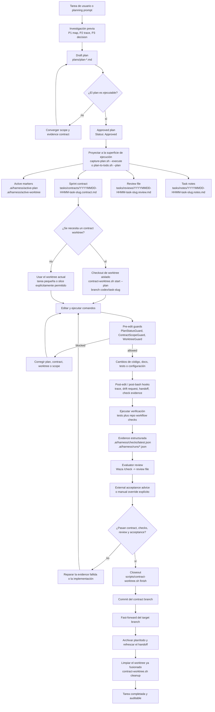
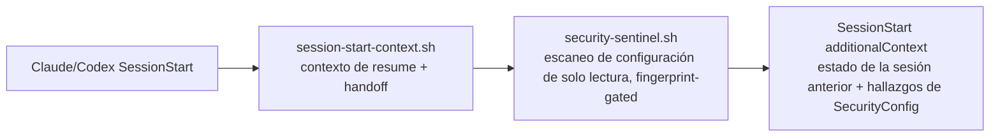
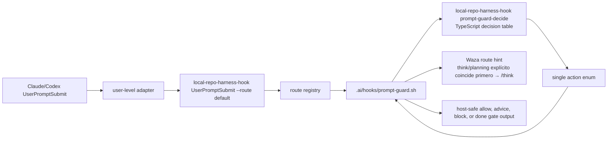

# local-repo-harness

`local-repo-harness` convierte las sesiones de programación con Claude/Codex en un
workflow repo-local repetible. Incluye un CLI y hooks de skill/runtime que
escriben contexto, planes, handoffs, checks y evidencias de review dentro del
proyecto, para que la siguiente sesión de agente continúe desde archivos y no
desde el historial de chat.

Úsalo para:

- adoptar un repositorio existente con un contrato de agente tasks-first
- mantener Claude y Codex alineados sobre los mismos planes, checks, handoffs y
  límites de contexto
- gastar menos tokens redescubriendo estructura gracias a CodeGraph y la carga
  progresiva de contexto

Entrega al agente un PRD o Sprint completo; después, tu bucle es solo review and
`next`, o iniciar `/goal` y quedar AFK.

[English](README.md) | [简体中文](README.zh-CN.md) | [日本語](README.ja.md) | [Français](README.fr.md) | [Español](README.es.md)

Dirección del repositorio: `https://github.com/automann/local-repo-harness`

## Por qué usar local-repo-harness

- **El estado de la sesión vive en archivos, no en el historial de chat.** Las
  distintas sesiones de agente —Claude, Codex, ahora o más tarde— se mantienen
  sincronizadas a través del repositorio en lugar de un hilo de chat. Cuando
  arranca una sesión nueva, `.ai/hooks/session-start-context.sh` inyecta el
  resume packet de la sesión anterior (`.ai/harness/handoff/resume.md`,
  `tasks/current.md`); al terminar la sesión y tras cada edición,
  `finalize-handoff.sh` y `post-edit-guard.sh` escriben de vuelta el siguiente
  handoff. Una tarea puede cortarse a mitad de camino y la siguiente sesión
  retoma directamente el next step exacto, los puntos de bloqueo y los archivos
  modificados sin tener que volver a inferirlos.
- **Ahorra tokens por diseño.** En lugar de los bucles grep+read que reescanean
  el repositorio en cada sesión, el harness usa el índice pre-construido de
  CodeGraph para hacer consultas estructurales (quién llama, a qué llama, dónde
  está definido) y, además, carga de contexto progresiva mediante
  `.ai/context/context-map.json` y `capabilities.json`: un root context pequeño y
  estable (~12KB), más bloques de capability que solo se cargan cuando los
  archivos que tocas los necesitan. Un agente lee un contract de capability de
  1KB o consulta el índice, en vez de gastar miles de tokens redescubriendo la
  estructura.

## Novedades en 0.2.1

- **Comando de inicialización global (`local-repo-harness init`).** Un solo comando
  inicializa el entorno global de Claude: essential plugins, policy
  hooks configurables (worktree guard, atomic commit/pending), LSP plugins
  opcionales según el tipo de proyecto y cuatro hook profiles (`standard`,
  `minimal`, `biome`, `biome-strict`). Ejecuta
  `npx -y local-repo-harness init`; no necesitas clonar el repositorio fuente.
- **Comando de adopción del repo (`local-repo-harness adopt`).** La instalación y el
  refresco de repos existentes tienen su propia superficie de comando, manteniendo
  la ruta de migración repo-local anterior mientras `init` queda dedicado al
  runtime global.
- **Auto-recuperación del índice CodeGraph.** Si el prompt hook detecta intención
  de navegación estructural y el repo no tiene índice `.codegraph`, inicializa el
  índice con el binario CodeGraph local o visible en PATH antes de emitir la pista.
  Sigue siendo advisory: no instala dependencias, no ejecuta el readiness probe
  pesado y no bloquea el prompt si CodeGraph no está disponible.
- **Centinela de seguridad (`local-repo-harness security scan` + `security-sentinel.sh`).**
  Una verificación de solo lectura sobre las superficies de inyección de
  configuración de alto valor (`~/.claude/settings.json`, `~/.codex/hooks.json`,
  el `.vscode/tasks.json` repo-local y los adapters legacy a nivel de proyecto
  `.claude`/`.codex`). Marca patrones de comando sospechosos —pipes de remote
  shell, base64-decode-to-exec, `osascript`, persistencia con
  `launchctl`/`crontab`, netcat, ejecución inline de intérpretes—, además de
  hooks no gestionados y tareas `folderOpen` de ejecución automática, y nunca
  modifica ninguna configuración. El centinela de `SessionStart` toma una huella
  de este conjunto y solo reescanea cuando la huella cambia, para no generar
  ruido en el session-start. Auditoría bajo demanda:
  `local-repo-harness security scan --json`.
- **Ciclo de vida draft-plan de Claude/Codex.** El Plan mode tiene explícitamente
  dos etapas: Draft y Approved. Los hooks reconocen la intención de crear un plan
  y rastrean la pending orchestration; un stop gate (`stop-orchestrator.sh`) exige
  que la sesión haga una pasada de autorevisión antes de terminar con el plan sin
  definir. Captura un borrador con `scripts/capture-plan.sh --slug <slug> --title
  <title> --status Draft`, después promociónalo a Approved y proyéctalo a
  ejecución con `--execute` o `scripts/plan-to-todo.sh --plan <plan>`. Los plans
  se convierten en la fuente de verdad a nivel de archivo en `plans/`.

## Qué hace el producto

`local-repo-harness` convierte el desarrollo asistido por IA de una "coordinación verbal
en el historial de chat" en un "estado de workflow auditable en el repositorio".
Instala en el repositorio objetivo un conjunto de contracts de archivos pequeño y
explícito, para que Claude, Codex y las personas tengan una misma fuente de verdad
sobre estas cuestiones:

- cuál es la intención de producto estable
- qué plan ya está aprobado para entrar en ejecución
- qué scope permite modificar el sprint contract actual
- qué checks, review y evidence prueban que la tarea está realmente completa
- cómo deben los hooks advertir, bloquear, registrar trace y hacer handoff entre
  sesiones

No es un agent gateway, ni un runtime de producto, ni un servicio de base de
datos, ni un MCP server. El límite del producto es claro: inspecciona el
repositorio objetivo, instala o refresca los archivos de workflow, enruta los host
events de Claude/Codex hacia los hooks repo-local, y luego verifica que esas
workflow surfaces sigan siendo coherentes.

## Cómo funciona

En conjunto hay tres capas:

1. **Capa del paquete fuente**: este repositorio mantiene la CLI, los command
   skill facades, los templates, los hook assets, el workflow contract, los tests
   y el release gate.
2. **Capa del contract del repositorio objetivo**: `local-repo-harness adopt` o la
   migración escribe `docs/spec.md`, `plans/`, `tasks/`, `.ai/context/`,
   `.ai/harness/`, helper scripts y `.ai/hooks/`.
3. **Capa del host adapter**: el `~/.claude/settings.json` y el
   `~/.codex/hooks.json` a nivel de usuario enrutan los events de Claude/Codex
   hacia `local-repo-harness-hook`. El hook entrypoint primero comprueba si el repo
   actual tiene un `.ai/harness/workflow-contract.json`; si no hay opt in, sale en
   silencio, y solo si hay opt in entra en los `.ai/hooks/*` del repo actual.

Para `UserPromptSubmit`, el adapter contract público sigue siendo
`local-repo-harness-hook UserPromptSubmit --route default`. El CLI route registry hace
dispatch de esa route a `.ai/hooks/prompt-guard.sh`. El shell hook se sigue
ocupando del parseo del host JSON, la lectura de los archivos de workflow, los
side effects de plan capture, el render del quality gate y el stdout/stderr
host-safe. La decisión sobre el prompt intent y el workflow state se delega al
TypeScript decision engine detrás de `local-repo-harness-hook prompt-guard-decide`, que
devuelve un action enum desde una decision table explícita. Así la configuración
del host no cambia, pero la capa más propensa a errores —el classifier y la
state-machine— deja de estar dispersa en ramas condicionales de shell.

El invariante central: los hechos persistentes viven en el repositorio, no en la
ventana de chat. Los hooks son solo aceleradores y guardrails; la verdadera
authority son los archivos de plan, contract, review, checks y handoff.

## Task Workflow: de Plan a Closeout

El diagrama de abajo asume que el harness ya está instalado en el repositorio
objetivo. Muestra el ciclo cerrado normal de una sola tarea: primero se forma un
plan, luego se proyecta al sprint contract, cuando hace falta se hace checkout de
un worktree aislado, se implementa bajo la protección de los hooks, y después se
verifica, se hace review, external acceptance y, por último, closeout.



## Bucles largos de producto

Para trabajo Greenfield y Brownfield, adelanta la discovery y el juicio de
engineering plan en Claude-Fable antes de pedirle a Codex que haga loops de
ejecución:

1. En Claude-Fable, usa gstack `office-hours` para product discovery o
   `plan-eng-review` para review del plan de ingeniería. La salida debe ser los
   development documents que fijan la intención de producto, la arquitectura, los
   riesgos y el evidence contract.
2. Convierte esos documentos en un PRD Sprint bajo `plans/prds/`, con un
   backlog ordenado y sub-plans detallados para cada execution slice.
3. Crea un Codex Goal que apunte a ese archivo de sprint. local-repo-harness puede
   entonces proyectar cada sprint item por el flow normal plan -> contract ->
   worktree -> verification.

Ese handoff mantiene precisos los loops largos: Claude-Fable se ocupa del juicio
amplio al inicio, el PRD Sprint es la durable source of truth, y Codex Goal mode
retoma contra un sprint concreto en vez de reinterpretar el chat original.

## Primeros 5 minutos

Esta es la ruta más rápida para evaluar si un repositorio real es apto para
adoptar este workflow. Empieza con el contrato repo-local y mantén desactivadas
las escrituras al runtime del host hasta que el dry-run se vea correcto.

### 1. Previsualizar solo el contrato repo-local

```bash
npx -y local-repo-harness adopt --dry-run \
  --host-adapter-scope none \
  --skill-scope none \
  --external-tool-scope none \
  --codegraph-mcp-scope none
```

Esta es la ruta de menor impacto: no escribe user hooks, user skills, user MCP
config ni estado de brain root. Solo informa el workflow contract que se crearía
o refrescaría.

### 2. Aplicar solo el contrato repo-local

```bash
npx -y local-repo-harness adopt \
  --host-adapter-scope none \
  --skill-scope none \
  --external-tool-scope none \
  --codegraph-mcp-scope none
```

Esto instala la superficie file-backed del workflow sin registrar adapters de
Codex/Claude y sin instalar external skills.

### 3. Activar project hooks y project skills

```bash
npx -y local-repo-harness adopt \
  --host-adapter-scope project \
  --runtime project-vendored-bun \
  --skill-scope project \
  --external-tool-scope none \
  --codegraph-mcp-scope none \
  --brain-mode manifest-only
```

Las skills de Codex viven en `.agents/skills`; las de Claude en
`.claude/skills`. Los adapters de proyecto viven en `.codex/hooks.json` y
`.claude/settings.json`. Codex debe confiar el archivo de hooks del proyecto en
Codex Settings antes de ejecutarlo.

### 4. Instalar el CLI opcionalmente

La ruta por defecto no requiere Node.js: el instalador usa Bun como runtime. Si
Bun no existe, instala Bun primero y después instala el CLI `local-repo-harness`.

```bash
# macOS / Linux
curl -fsSL https://raw.githubusercontent.com/automann/local-repo-harness/main/install.sh | sh

# Windows (PowerShell)
irm https://raw.githubusercontent.com/automann/local-repo-harness/main/install.ps1 | iex
```

<details>
<summary>¿Ya tienes Bun o Node? Usa gestores de paquetes</summary>

```bash
# Bun
bun add -g local-repo-harness
local-repo-harness adopt --dry-run

# Node/npm, con Bun ya en PATH porque el CLI corre sobre Bun
local-repo-harness adopt --dry-run
```

</details>

### 5. Bootstrap user-level opcional

```bash
npx -y local-repo-harness init
```

`local-repo-harness init` es una ruta de bootstrap de máquina con impacto amplio.
Instala el CLI global, refresca aliases de skills, escribe hook adapters
user-level para Codex/Claude, instala Waza/Mermaid en user skill roots,
persiste el brain root en `~/.repo-harness/config.json` y configura CodeGraph
MCP user-level. Úsalo solo cuando quieras local-repo-harness disponible para varios
repositorios de la máquina.

Si trabajas desde un checkout del código fuente:

```bash
git clone https://github.com/automann/local-repo-harness.git ~/Projects/local-repo-harness
cd ~/Projects/local-repo-harness
bun src/cli/index.ts init
```

Modelo de rutas locales:

- Repositorio fuente: `~/Projects/local-repo-harness`
- Claude skill alias: `~/.claude/skills/repo-harness`
- Codex discoverable skill alias: `~/.codex/skills/repo-harness`

`~/Projects/local-repo-harness` es la única source of truth editable. Las rutas locales
de Claude/Codex son runtime entrypoints respaldados por symlinks. Los directorios
de los runtimes ya retirados `repo-harness-skill` y `project-initializer` los
elimina `scripts/sync-codex-installed-copies.sh`.

### Prerrequisitos mínimos

- Git working tree
- `bash`
- `bun`, para la verificación posterior y el template assembly
- `jq` es opcional; se recomienda al hacer `--dry-run` y resulta más útil al
  aplicar el settings merge

### Empieza por aquí

En un repositorio existente, ejecuta desde el repo root:

```bash
npx -y local-repo-harness adopt --dry-run
```

Aplica solo después de que el reporte del dry-run sea correcto:

```bash
npx -y local-repo-harness adopt
```

Para un proyecto o módulo nuevo, usa la branch command `repo-harness-scaffold`.
Para un repositorio existente, usa `local-repo-harness adopt`; este instala o refresca
el harness y no crea el stack tecnológico de la aplicación.

### Cómo se ve el éxito

El comando debería terminar imprimiendo `=== Migration Report ===`, e incluir:

- `Project hooks synced from:`: de dónde proviene el comportamiento de los hooks generados
- `Host hook config target: user-level ~/.claude/settings.json and ~/.codex/hooks.json`: dónde está la capa del adapter
- `Host hook adapters are user-level:`: recordatorio de instalar los global adapters y de confiar en `~/.codex/hooks.json`
- `Workflow migration:`: el plan de creación o refresco de las repo-local harness surfaces
- `Helper scripts:`: la cadena de herramientas operativa que obtendrás tras aplicar
- `--- External Tooling ---`: el routing de gstack/Waza/gbrain más las advisory de instalación/actualización

### Los dos comandos siguientes

```bash
bash scripts/check-task-workflow.sh --strict
bun test
```

Si la salida del dry-run no es correcta, detente aquí primero y lee
[`docs/reference-configs/hook-operations.md`](docs/reference-configs/hook-operations.md).

## Hook Authority Map

- `.ai/hooks/` es la única shared hook implementation que se debe editar de forma prioritaria.
- `~/.claude/settings.json` es el Claude adapter a nivel de usuario, encargado de hacer dispatch a los opted-in repos.
- `~/.codex/hooks.json` es el Codex adapter a nivel de usuario, hace dispatch al mismo runner.
- Los hook adapters repo-local `.claude/settings.json` y `.codex/hooks.json` son legacy project-level config y deben retirarse durante la migración.
- Codex debe confiar en `~/.codex/hooks.json` en sus Settings para que los hooks se ejecuten.
- Orden de depuración: user-level adapter config -> `local-repo-harness-hook` o el fallback `local-repo-harness hook` -> route registry -> `.ai/hooks/*`.

`SessionStart` ejecuta dos scripts ordenados antes de empezar el trabajo:



El prompt guard tiene un paso interno adicional:



La capa de shell sigue teniendo la authority del sistema de archivos y los side
effects. TypeScript solo tiene el classifier más la decision table de
`intent x plan state`.

## Hook Failure Playbook

Cuando un hook block está activo, mira primero la salida estructurada en el
terminal. Los campos centrales son `guard`, `reason`, `fix`, `failure_class` y
`run_id`.

- Failure log: `.ai/harness/failures/latest.jsonl`
- Trace log: `.claude/.trace.jsonl`
- Guía detallada: [`docs/reference-configs/hook-operations.md`](docs/reference-configs/hook-operations.md)

Guards habituales:

- `PlanStatusGuard`: no hay active plan, o el plan todavía no puede ejecutarse
- `ContractGuard`: la approved execution aún no ha generado el scaffold de contract/review/notes
- `ContractGuard`: la tarea afirma estar completa sin haber pasado la contract verification
- `WorktreeGuard`: se escribe desde el primary worktree bajo una política que fuerza linked worktrees

## Repo Workflow

- Root routing docs: `CLAUDE.md`, `AGENTS.md`
- Shared hook layer: `.ai/hooks/`
- User-level adapter layer: `~/.claude/settings.json`, `~/.codex/hooks.json`
- Active execution surface: `tasks/`
- Plan source of truth: `plans/`
- Durable progress: `tasks/workstreams/`
- Release history: `docs/CHANGELOG.md`

## Release actual

- npm package: `local-repo-harness@0.5.0`
- Generated workflow stamp: `local-repo-harness@0.5.0+template@0.5.0`
- GitHub repository: `automann/local-repo-harness`
- Release history: [`docs/CHANGELOG.md`](docs/CHANGELOG.md)

## Current Model

- El question flow usa **12 grouped decision points**, infiriendo primero los harness defaults.
- El plan menu está por capas: los **Core Plans (A-F)** primero, los **Custom Presets (G-K)** solo cuando hace falta.
- El skill routing es inspection-first:
  - `scripts/inspect-project-state.ts`
  - `scripts/migrate-workflow-docs.ts`
  - `assets/workflow-contract.v1.json`
- Los generated repos usan por defecto el repo-local harness flow:
  - `docs/spec.md -> plans/ -> tasks/contracts/ -> tasks/reviews/ -> .ai/context/context-map.json -> .ai/harness/*`
- `local-repo-harness update` refresca las runtime pieces de usuario:
  - los `repo-harness` skill aliases
  - los global Codex/Claude hook adapters
  - las Waza skills: `think`, `hunt`, `check`, `health`
  - Mermaid
- El resto del external tooling se mantiene advisory-only:
  - `bash scripts/check-agent-tooling.sh --host both --check-updates`
  - no configura automáticamente gstack, gbrain, CodeGraph MCP, daemon ni provider

## Agradecimientos

Gracias a [Hylarucoder](https://x.com/hylarucoder) por su contribución
metodológica. El método P1/P2/P3 due-diligence de `local-repo-harness`, y la práctica
Geju que disciplina el planning, el trace y el decision rationale, vienen de su
contribución e influencia.

Gracias a [TW93](https://x.com/HiTw93), autor de Waza. Los skills centrales
`think`, `hunt`, `check` y `health` dan forma al ritmo diario de planning, bug
hunt y verification de `local-repo-harness`.

Gracias a [Garry Tan](https://x.com/garrytan), autor de gstack y gbrain. Ambos
influyeron en el workflow de product discovery, plan/design review, release
documentation, knowledge sync y handoff retrieval.

## Action Command Skills

Los command facades públicos están en `assets/skill-commands/`; preservan la
compatibilidad de discovery por skills, mientras el CLI y los hooks ejecutan:

- Planning / review: `repo-harness-plan`, `repo-harness-review`, `repo-harness-autoplan`
- Repo workflow actions: `repo-harness-ship`, `repo-harness-init`, `repo-harness-migrate`, `repo-harness-upgrade`, `repo-harness-capability`, `repo-harness-architecture`, `repo-harness-handoff`, `repo-harness-deploy`, `repo-harness-repair`, `repo-harness-check`
- Branch project creation: `repo-harness-scaffold`

`local-repo-harness adopt` se usa para repositorios existentes; `repo-harness-scaffold`
queda como branch command para crear proyectos o módulos nuevos. `hooks-init`, `docs-init` y
`create-project-dirs` son pasos internos, no commands públicos.

## Maintainer Reference

### Verificar el workflow contract de este repositorio

```bash
bash scripts/check-task-sync.sh
bash scripts/check-task-workflow.sh --strict
bun scripts/inspect-project-state.ts --repo . --format text
bash scripts/migrate-project-template.sh --repo . --dry-run
```

### Template assembly

```bash
bun scripts/assemble-template.ts --plan C --name "MyProject"
bun scripts/assemble-template.ts --target agents --plan C --name "MyProject"
```

### Verification

```bash
bun test
bash scripts/check-task-sync.sh
bash scripts/check-task-workflow.sh --strict
bun scripts/inspect-project-state.ts --repo . --format text
bash scripts/migrate-project-template.sh --repo . --dry-run
bash scripts/check-agent-tooling.sh --host both --check-updates
bun run benchmark:skills --dry-run
```

## Key Files

- Skill spec: `SKILL.md`
- Root routing docs: `CLAUDE.md`, `AGENTS.md`
- Plan mapping: `assets/plan-map.json`
- Question-pack: `assets/initializer-question-pack.v4.json`
- Shared hooks: `assets/hooks/`
- Workflow contract: `assets/workflow-contract.v1.json`
- Hook operations reference: `docs/reference-configs/hook-operations.md`
- Template assembler: `scripts/assemble-template.ts`
- State inspector: `scripts/inspect-project-state.ts`
- Legacy-doc migrator: `scripts/migrate-workflow-docs.ts`
